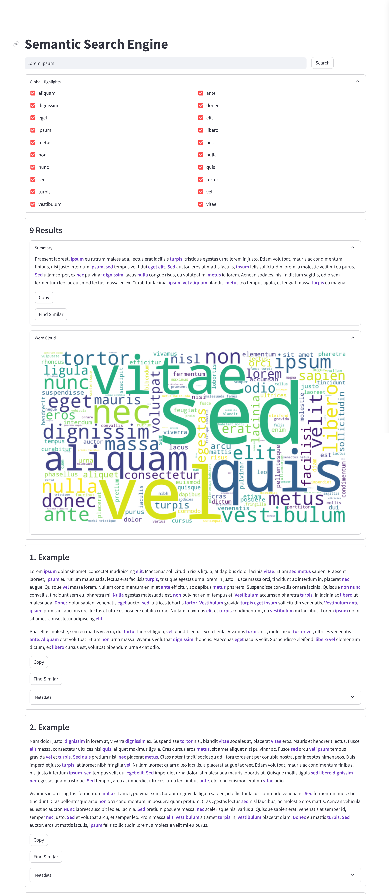

# Streamlit-SemanticSearchEngine

This project brings a powerful search engine that goes beyond simple keyword matching, using natural language understanding to dig through documents efficiently.

## Features

- **Semantic Search**: Finds the most relevant information within documents by understanding context and semantics.
  - Maximum Marginal Relevance (MMR) - A search result diversification technique that ensures the returned results are as different from each other as possible.
  - Similarity Scoring - Uses cosine similarity to rank search results based on their relevance to the query.
  - Thresholded Similarity - Allows users to set a minimum similarity score for search results, ensuring only the most relevant documents are returned.
- **Search Summary**: Offers comprehensive summaries of search results using various summarization techniques
  - Using `summa` and `sumy` libraries, the search engine can generate summaries of search results using various summarization techniques, such as LSA, Luhn, Edmundson, TextRank, LexRank, KL-Sum, etc.
  - Large-Language Model summarization coming in a future release.
- **Keyword & Phrase Highlighting**: Important keywords and phrases are highlighted in search results, enabling faster skimming and identification of crucial information.
  - Methods: Yake, Rake, Multi-Rake, and TextRank.
- **Word Cloud**: Visualize the most prominent terms from search results with an automatically generated word cloud.
- **Find Similar**: Allows users to find results similar to the ones they are interested in with just one click.
- **Customizability**: Offers complete control over the user experience, including the user interface, similarity scoring, summarization, and highlighting options, ensuring a tailored search experience.

## Getting Started

### Installation

Clone this repository and install the necessary dependencies to get the search engine up and running:

```bash
pip install -r requirements.txt
```

### Environment Setup

An OpenAI API is used to extract vector embeddings for the documents. You can get your API key from the [OpenAI website](https://platform.openai.com/api-keys).
Once you have your API key, set it as an environment variable:

```bash
export OPENAI_API_KEY="sk-XXXXXXXXXXXXXXXXXXXXXXXXXXXXXXXXXXXXXXXXXXXXXXXX"
```

### Running the Application

Drop your Markdown files into the `./docs` directory relative to the project root.
The search engine will automatically index the documents in this directory and make them available for search.

To launch the search engine, simply run:

```
streamlit run app.py
```

### Example (Lorem Ipsum)



### Contributing

Your ideas and improvements are welcome! Feel free to fork the project, make your enhancements, and submit a pull request.

### License

Distributed under the MIT License. See [./LICENSE] for more information.
